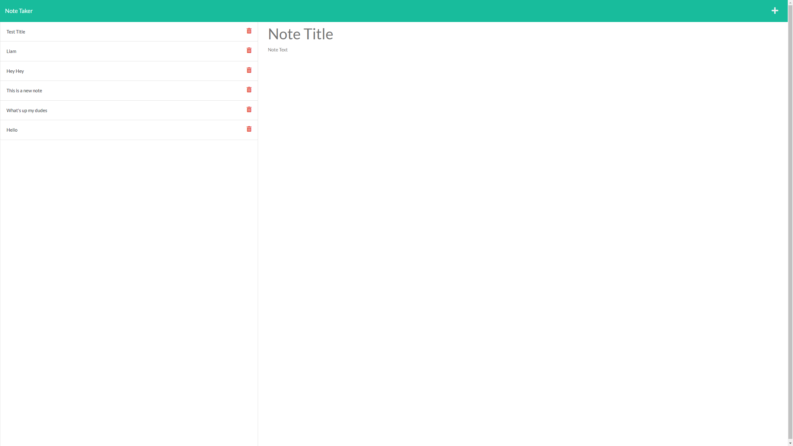

# Note-Taker

## Description
Note Taker is an application that allows a user to take notes and save them to
view later.  Upon launching, the user is prompted to redirect to the note taking
page.  Here the user will see any existing notes and an area that prompts them for 
a title and text for a new note.  If a title and text are inputed, a save button will 
appear at the upper right. 

## Technologies Used
* Javascript
* HTML
* CSS
* Git
* Github
* Heroku
* Express
* Node.js
* Visual Studio Code
* Bootstrap

## Deployed Application

https://note-taking-app-liam.herokuapp.com/ < - - - - -



## Code

```Javascript
app.get('/notes', (req, res) => { 
    res.sendFile(path.join(__dirname, './public/notes.html'))
});

app.get('/api/notes', (req, res)  => {
    fs.readFile('./db/db.json', 'utf8', (err, data) => {
        if (err) {
            console.error(err);
            res.json("WOOPS")
        } else {
            const parsedNote = JSON.parse(data);
            res.json(parsedNote);
        }
    })
});

app.get('*', (req, res) => {
  res.sendFile(path.join(__dirname, './public/index.html'))
});

```
Here we have different api call handlers for homepage "/",
notes page "/notes" and existing notes through "/api/notes" 

## Uses
This application is used to create notes to hold any information you may 
need to revisit.


## License

MIT License

Copyright (c) 2022 Liam McCarthy

Permission is hereby granted, free of charge, to any person obtaining a copy
of this software and associated documentation files (the "Software"), to deal
in the Software without restriction, including without limitation the rights
to use, copy, modify, merge, publish, distribute, sublicense, and/or sell
copies of the Software, and to permit persons to whom the Software is
furnished to do so, subject to the following conditions:

The above copyright notice and this permission notice shall be included in all
copies or substantial portions of the Software.

THE SOFTWARE IS PROVIDED "AS IS", WITHOUT WARRANTY OF ANY KIND, EXPRESS OR
IMPLIED, INCLUDING BUT NOT LIMITED TO THE WARRANTIES OF MERCHANTABILITY,
FITNESS FOR A PARTICULAR PURPOSE AND NONINFRINGEMENT. IN NO EVENT SHALL THE
AUTHORS OR COPYRIGHT HOLDERS BE LIABLE FOR ANY CLAIM, DAMAGES OR OTHER
LIABILITY, WHETHER IN AN ACTION OF CONTRACT, TORT OR OTHERWISE, ARISING FROM,
OUT OF OR IN CONNECTION WITH THE SOFTWARE OR THE USE OR OTHER DEALINGS IN THE
SOFTWARE.